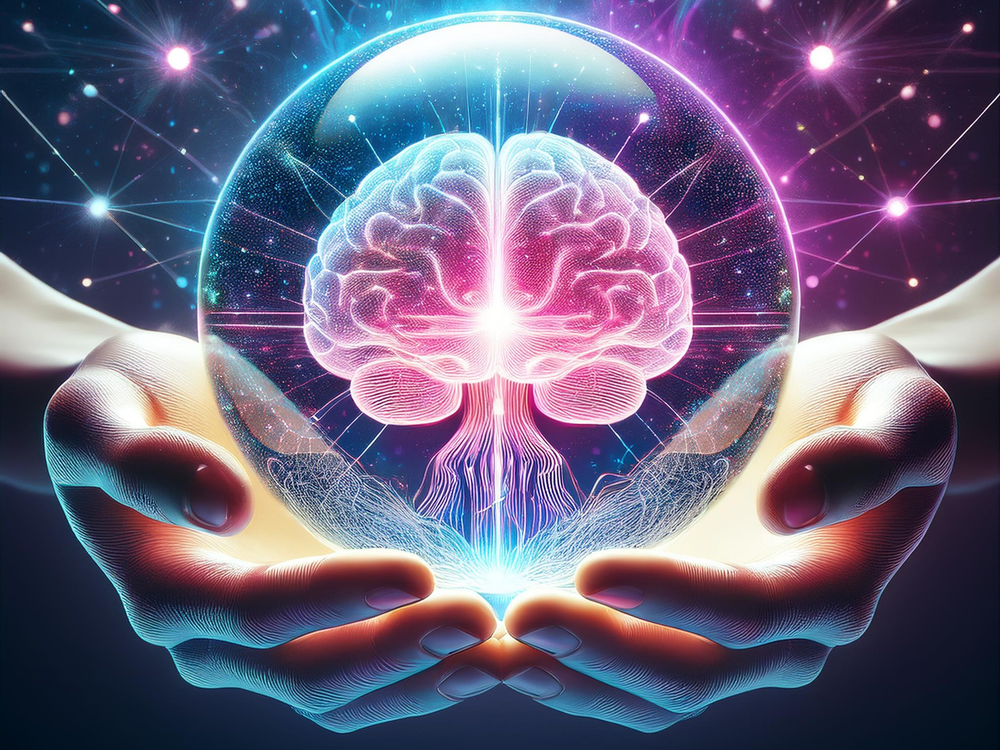

# Applied Neural Networks

*Christoph Würsch*

## Kursbeschreibung

Der Kurs "Applied Neural Networks" vermittelt eine umfassende Einführung in die theoretischen und praktischen Aspekte künstlicher neuronaler Netze. Die Teilnehmenden lernen die grundlegenden Konzepte, den Aufbau und die Funktionsweise dieser Netzwerke kennen. Der Fokus liegt auf der Entwicklung eines tiefgehenden Verständnisses für die mathematischen Grundlagen, die verschiedenen Netzwerkarchitekturen sowie deren Training und Optimierung.

Ein zentraler Bestandteil des Kurses ist die praktische Anwendung. Die Teilnehmenden implementieren verschiedene Architekturen und trainieren eigene Modelle mit gängigen Frameworks wie TensorFlow oder PyTorch. Dabei wird eine vollständige Deep Learning Pipeline entwickelt, die von der Datenaufbereitung über das Training bis hin zur Evaluierung und Optimierung der Modellleistung reicht. Der Kurs behandelt sowohl grundlegende Architekturen wie Multilayer Perceptrons als auch fortgeschrittene Modelle wie Transformer und Diffusion Models.

Durch eine Kombination aus theoretischem Wissen und praxisnahen Übungen erwerben die Teilnehmenden die Fähigkeiten, moderne neuronale Netze zu verstehen, selbstständig zu implementieren und in realen Anwendungen einzusetzen.

## Lernziele

Am Ende des Kurses werden die Teilnehmenden:

* Die grundlegenden Prinzipien neuronaler Netze verstehen

* Die Basis-Elemente eines neuronalen Netzwerks kennen

* Die verschiedenen Trainingsmethoden und Optimierungsverfahren anwenden können

* Unterschiedliche Architekturen implementieren und evaluieren können

* Eine vollständige Deep Learning Pipeline entwickeln

## Kursinhalte

Der Kurs gliedert sich in folgende Themenbereiche:

* **Grundlagen künstlicher neuronaler Netze**

    * Aufbau eines neuronalen Netzwerks

    * Neuronen, Aktivierungsfunktionen und Gewichtsanpassung

    * Backpropagation und Gradient Descent

* **Training und Optimierung**

    * Verlustfunktionen und Optimierungsalgorithmen

    * Overfitting, Regularisierung und Hyperparameter-Tuning

    * Datenaufbereitung und Vorverarbeitung

* **Architekturen neuronaler Netze**

    * Multilayer Perceptrons (MLPs) zur Veranschaulichung grundlegender Konzepte

    * Convolutional Neural Networks (CNNs) für Bildverarbeitung

    * Recurrent Neural Networks (RNNs) und LSTMs für Sequenzdaten

    * Transformer-Modelle für Natural Language Processing

    * Diffusion Models als moderne Architekturen für Generative AI

* **Implementierung einer Deep Learning Pipeline**

    * Datenaufbereitung und Einlesen der Daten

    * Modell-Training und Hyperparameter-Optimierung

    * Evaluierung und Interpretation der Modell-Performance

    * Deployment von trainierten Modellen

## Repository Struktur

### Instruktionen

Der Ordner `intros` entält Grundlagen zu den im Kurs verwendeten Werkzeugen

* **Python** Installation und Basics (aufbauend auf bisherigem Wissen)
* **Git** Einführung und Grundlegende Verwendung von Git
* **VS-Code** Installation und erstellen einer Python Umgebung

### Lektionen

Die Lektionen sind nach Unterrichtswochen strukturiert. Die jeweiligen Unterlagen pro Unterrrichswoche finden Sie im jeweiligen Ordner.
